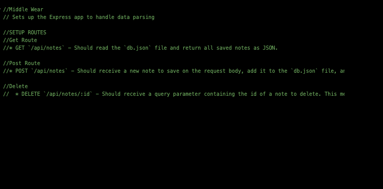
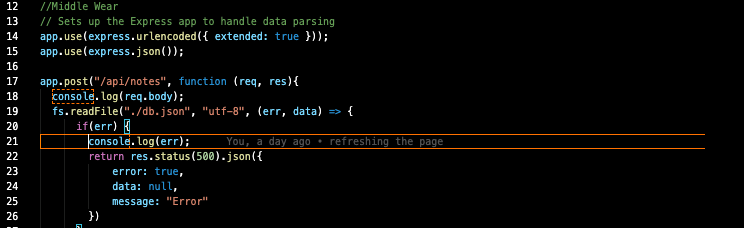
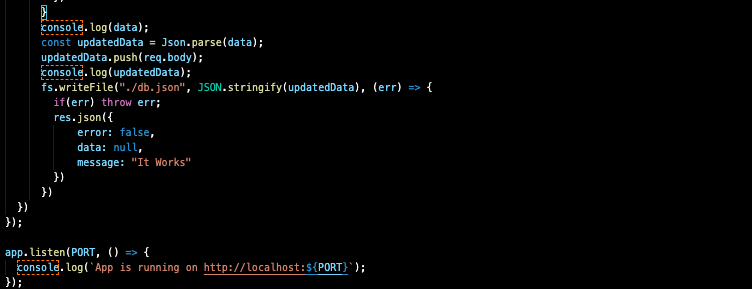

## Basic Setup

<!-- 1.Create a server.js
2.Run the npm init -y
3.Run the npm install express -->

## Time To Start

Get Route
Post Route
Delete

## User Story

AS A user, I want to be able to write and save notes

I WANT to be able to delete notes I've written before

SO THAT I can organize my thoughts and keep track of tasks I need to complete

This Homework was fun.

- [ ] Completed task
- [x] Unfinished task

**Here are a few snap shoots where i was having problems.** 

**Here is where we done this in class**

# I wil bet better asap......

